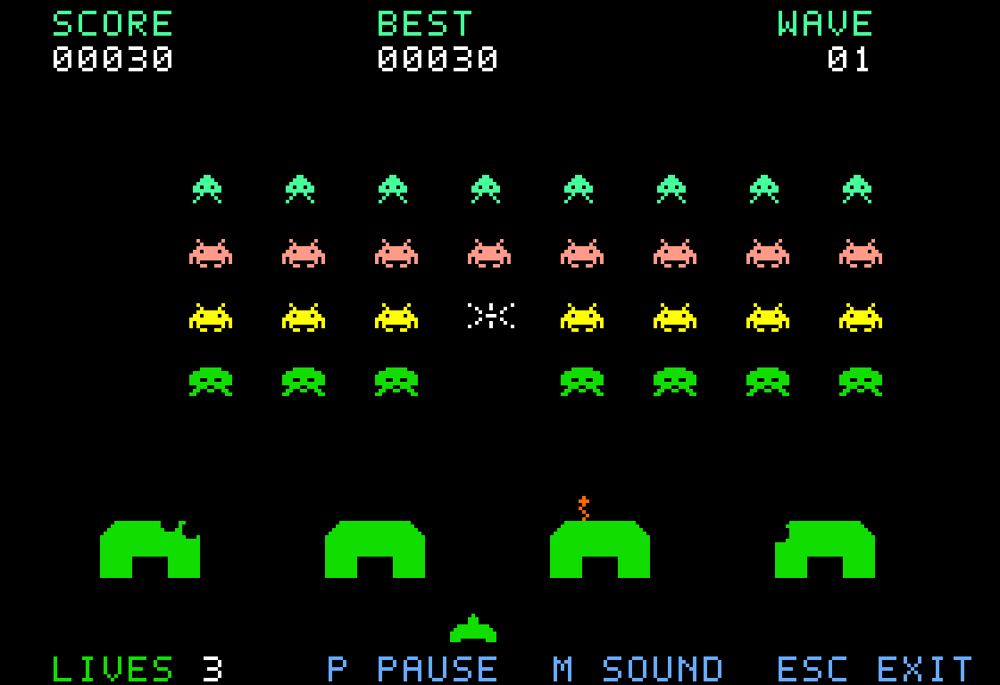
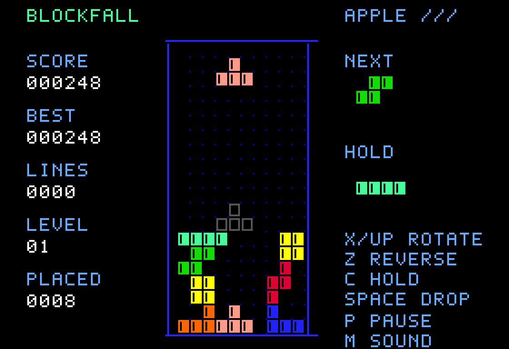
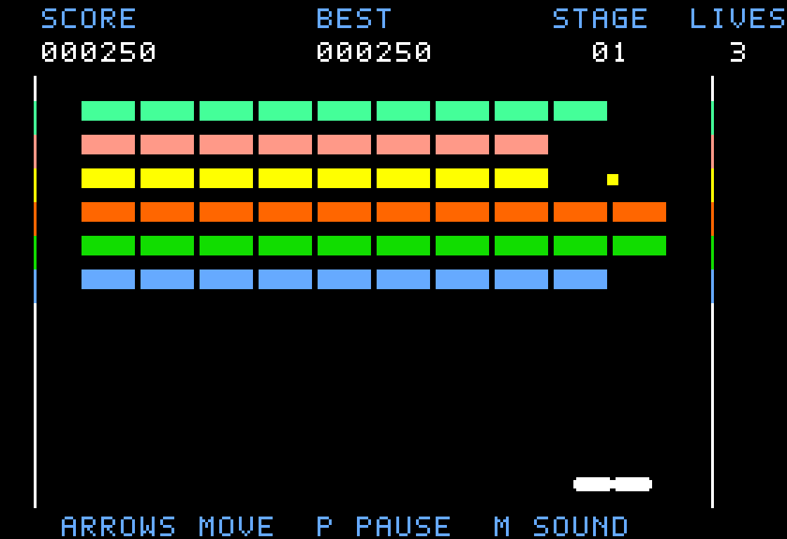

# Apple III Games

Native Apple /// games, built together in one repository. Each game boots directly
from its own floppy image. Shared 6502 platform code handles graphics, frame
timing, sound and booting; individual games live under `games/`.

| Game | Style | Play |
| --- | --- | --- |
| Star Siege /// | Space Invaders-style shooter | `make run GAME=invaders` |
| Blockfall /// | Tetris-style falling blocks | `make run GAME=tetris` |
| Brick Bash /// | Breakout-style paddle game | `make run GAME=breakout` |

The games use native 280×192 color graphics, original artwork and font, speaker
effects, pause, mute and restart. They require at least 128 KB of RAM and the
original Apple III boot ROM. No SOS disk, Apple II emulation, expansion card or
downloaded game assets are needed.

## Star Siege ///

A Space Invaders-style arcade game for the Apple III. Defend against 32 animated
invaders, carve holes through four destructible bunkers, dodge enemy fire and
hunt the passing mystery ship. Surviving invaders accelerate. Each cleared wave
repairs the shields and brings a faster fleet. Three lives, an extra life at
1,500 points, and a high score retained until the machine resets.



## Blockfall ///

A Tetris-style puzzle game with all seven tetrominoes, a shuffled seven-piece bag,
next-piece preview, hold and a ghost landing guide. Rotate against walls and the
floor, soft or hard drop, and clear up to four lines at once. Every ten lines
raises the speed, up to level 20. A short lock delay gives you time to slide a
piece into place. Best score stays in memory until reset.



[Blockfall controls and rules](games/tetris/README.md)

## Brick Bash ///

Break a wall of sixty colored bricks with a ball and paddle. Where the ball hits
the paddle controls its rebound angle. Clear the wall to advance; later stages
add armored bricks and faster ball movement. Three lives, pause, sound and a
best score retained until reset.



[Brick Bash controls and rules](games/breakout/README.md)

## Build and play

Install [cc65](https://cc65.github.io/), Python 3.9 or later, Make and
[MAME](https://www.mamedev.org/). On macOS:

```sh
brew install cc65 mame
make
make run GAME=invaders
# Or:
make run GAME=tetris
```

The emulator needs your Apple III ROM set. Put these files under the ignored
`build/local-roms/` directory, or point `MAME_ROMPATH` at an existing MAME ROM
directory containing the `apple3` and `a3fdc` sets:

```text
build/local-roms/apple3/apple3.rom       4096 bytes, CRC32 1af7ec42
build/local-roms/a3fdc/341-0028-a.rom      256 bytes, CRC32 b72a2c70
```

```sh
MAME_ROMPATH=/path/to/mame/roms make run
```

ROMs are not part of the repository or generated game disks. The launcher selects
the original BIOS explicitly, so the optional SOSHDBOOT ROM is not required.
All emulator settings and snapshots stay under `build/`.

Star Siege controls:

| Action | MAME | Native Apple III keyboard |
| --- | --- | --- |
| Start / restart | Space or Return | Space or Return |
| Move | Hold Left/Right or A/D | Hold Open/Solid Apple |
| Fire | Hold Space or Shift | Hold Shift; Space also fires |
| Pause / resume | P | P |
| Mute / unmute | M | M |
| Return to title | Escape | Escape |

Native A/D and cursor keys also move the ship using keyboard repeat. The Apple
keys and Shift provide independent, continuous movement and firing. The MAME
launcher maps modern controls onto those real hardware inputs. Close the MAME
window to quit the emulator.

Blockfall controls:

| Action | MAME | Native Apple III keyboard |
| --- | --- | --- |
| Move | Hold Left/Right or A/D | Hold Open/Solid Apple; arrows or A/D also work |
| Rotate clockwise / counterclockwise | Up or X / Z | Up or X / Z |
| Soft drop | Hold Down or S | Hold Control; Down or S also work |
| Hard drop | Space or Shift | Shift or Space |
| Hold / swap piece | C | C |
| Start / restart, pause, sound, title | Space/Return, P, M, Escape | Same |

Holding the mapped hard-drop key places only one piece. Native character keys use
the keyboard's repeat; Shift provides an independently readable hard-drop edge.

## Game disks

`make` builds every game, producing two 140 KB boot images per game:

| Game | ProDOS sector order (MAME default) | DOS sector order (MiSTer) |
| --- | --- | --- |
| Star Siege | `build/invaders/invaders.po` | `build/invaders/invaders.dsk` |
| Blockfall | `build/tetris/tetris.po` | `build/tetris/tetris.dsk` |
| Brick Bash | `build/breakout/breakout.po` | `build/breakout/breakout.dsk` |

Mount either image in the Apple III's **internal / first floppy drive**, then
reset or power on. Preserve the extension because it identifies the sector order.
These are standalone boot disks, **not SOS or ProDOS filesystems**. The game makes
no disk writes; high scores are held in RAM only.

For the Apple-III-MiSTer core, copy the `.dsk` into its game directory, mount it in
the internal drive and reset. This release was tested in MAME; physical Apple III
and FPGA hardware validation remains to be done.

## Test

```sh
make test-all                # Every game and disk packaging
make test GAME=tetris        # Blockfall only, plus disk packaging
make test GAME=invaders      # Star Siege only, plus disk packaging
python3 tools/mame.py test breakout --windowed  # Watch a suite at normal speed
```

The tests cold-boot the actual disk in MAME, run the assembled 6502 game and save
screenshots under `build/<game>/test/`. Failures return a nonzero exit status.

- Three Python checks cover disk geometry, ROM block ordering and boot payloads.
- Thirty Star Siege emulator checks cover native mode, controls, bounds, shooting
  and scoring, speaker accesses, pause, mute, shield damage, mystery-ship scoring,
  extra lives, respawn protection, game over, restart and wave progression.
- Blockfall checks cover controls, hard-drop release, hold, all 28 piece/rotation
  combinations, wall and floor kicks, blocked rotation, lock delay and its reset
  limit, one-to-four-line clears, board compaction, scoring, speed progression,
  the seven-piece bag, top-out, pause, sound, restart and program integrity.
- Each full suite runs the `.po` with 256 KB. Additional boot/control checks run
  every `.dsk` image with 128 KB of RAM.
- Brick Bash checks cover an input-only rally, wall and paddle rebounds, brick
  scoring, armor, life loss, retries, stage progression, pause and mute.

The first gameplay tests use only emulated key presses. Later tests arrange rare
collision and end-of-wave situations in RAM, then let the game's actual code
resolve them. No game code or graphics are injected in place of booting.

Validated with MAME 0.289 and Homebrew cc65 2.19. `MAME`, `CL65`, `CA65`, `LD65`
and `PYTHON` can override tool paths. `make clean` removes generated game and test
directories while preserving `build/local-roms/`.

## Add another game

Create `games/<name>/main.c` and `games/<name>/sprites.json`. The top-level Makefile
discovers the directory and builds it with the common runtime:

```sh
make
make run GAME=<name>
```

Add `tests/<name>.lua` to enable `make test GAME=<name>` and include the game in
`make test-all`. An optional `games/<name>/controls.lua` customizes MAME controls.
See [the platform guide](docs/platform.md) for the memory map, graphics API, asset
format, boot contract and source references.
