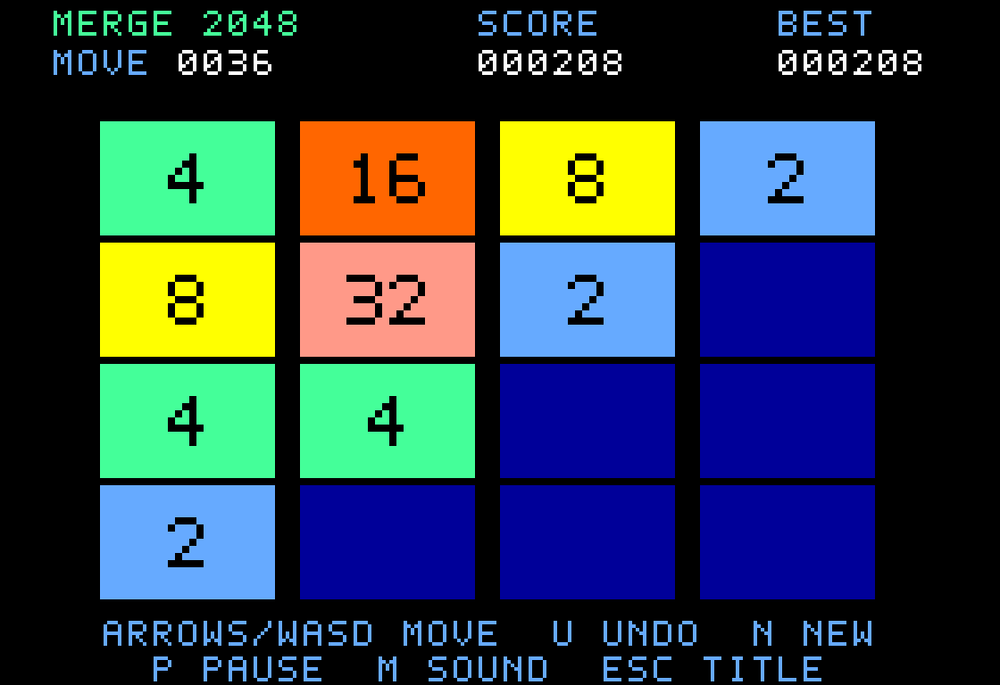

# Merge 2048 ///

A 2048-style game for the native Apple III. Run `make run GAME=2048`.

Use the arrow keys or WASD to slide every tile. Equal tiles merge once per move:
`2 2 2 2` becomes `4 4`, and `2 2 4` becomes `4 4`. Each merge adds the value of
the new tile to your score. A successful move adds a 2 (90%) or 4 (10%) to a random
empty cell. A move that leaves the board unchanged adds nothing.

Reach 2048 to win, then press Return to continue toward larger tiles. The game
ends when no moves remain. Tiles are supported through 32768; two 32768 tiles
do not merge. Scores cap at 999,999 and the move counter at 9,999.

- **U:** undo one move, restoring the board, score and random sequence. Replaying
  that move produces the same new tile. An unchanged move preserves undo.
- **N:** start a new board. Best score stays until machine reset, including after
  undo; it records the highest score reached during the session.
- **P:** pause or resume. **M:** mute/unmute. **Escape:** return to the title.
- **Space or Return:** start from the title.

The game uses ordinary Apple III letter/cursor inputs. No modifier-key remapping
is needed. Only changed tiles are redrawn to keep moves responsive on the 6502.

`make test GAME=2048` boots both disk formats in MAME, plays through keyboard
input, and exercises specific merge/undo/win/loss positions. Screenshots and test
results are saved under `build/2048/test/`. The screenshot above is from input-only
play. Boot disks are `build/2048/2048.po` and `build/2048/2048.dsk`; see the
[root guide](../../README.md) for ROM setup and mounting instructions.
