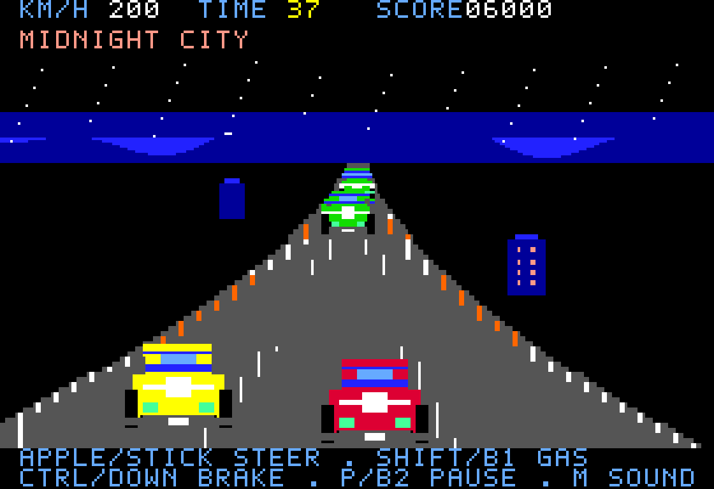

# Highway /// — The Grand Tour

A native Apple III road racer for **256 KB RAM**, with a red sports car, three
stages, hills, bends, traffic and a countdown against the clock. Drive through
Sunset Coast and its lighthouse tunnel, Amber Canyon, and Midnight City.

Hold the accelerator, steer around traffic, and reach each checkered checkpoint.
You start with **45 seconds**; the first two checkpoints add **35 seconds** each.
A clean overtake earns 100 points, each checkpoint earns 1,000, and the finish
adds a time bonus. Grass slows you down. Collisions cost two seconds and knock
your speed down, with a brief recovery period. Your best score lasts until reset.
The road follows a fixed route; traffic varies between attempts.



## Play

On an installed Apple-III-MiSTer core, mount **Highway III.dsk** in Drive 1 and
press **Ctrl+F12**. The standalone disk includes the game and its assets; it needs
no SOS disk. Loading the large asset set takes longer than the other games.
A 128 KB machine shows an explicit RAM requirement instead of starting.

For joystick play, use **controller 1** and set the core's **Joystick 1 on**
option to **Port B** (the default).

| Action | MiSTer controller 1, Port B | Native Apple III keyboard | MAME keyboard |
| --- | --- | --- | --- |
| Start / retry | Button 1 | Space or Return | Space or Return |
| Steer | Stick or D-pad left/right | Hold Open / Solid Apple | Hold Left/Right or A/D |
| Accelerate | Hold button 1 | Hold Shift | Hold Space or Shift |
| Brake | Hold down | Hold Control | Hold Down, S or Control |
| Pause / resume | Button 2 | P | P |
| Sound | M on keyboard | M | M |
| Title | Escape on keyboard | Escape | Escape |

On MiSTer, Open Apple is Windows/Command and Solid Apple is Alt. Use these
modifier keys for continuous steering with this core; held arrow keys also
activate its Solid Apple input. Native A/D, arrows and Space work through key
repeat. The joystick switch is latched: either transition toggles pause.

The title runs an attract scene. The spoken countdown and scene preparation do
not consume race time. A paused game freezes the clock and silences the engine.

## Build and test

```sh
make run GAME=highway
python3 tools/mame.py test highway
python3 tools/test_highway_core.py ../Apple-III-MiSTer
```

The MAME suite cold-boots both disk formats with the original ROM, checks the
128 KB error screen, exercises keyboard and joystick controls, collisions,
pause, mute, checkpoints, timeout and retry, and verifies the loaded program
and all asset banks. A separate driver completes a tour using only emulated
joystick inputs, without changing game state.

The core test snapshots the supplied checkout, including uncommitted files,
without modifying it. It preloads the same game bytes and uses an original
reset stub to test the actual CPU, memory banking, video pages, VIA clock, DAC,
and joystick. Disk loading itself is covered by the stock-ROM MAME tests.
`--reuse-snapshot` repeats against the recorded snapshot under `build/highway/core`.
No physical MiSTer play test has been claimed.

## What uses the extra hardware

- Native **280×192 RGB** graphics, respecting two colors in each seven-pixel
  group, with two complete graphics pages in bank zero.
- **81 road poses** with nine hill profiles. The renderer updates changed road
  boundaries and markings, and retains unchanged object positions between pages.
- **128 car/scenery variants** plus four checkpoint banners, compiled into 6502
  drawing routines. Four car colors share code through indexed palettes.
- Native **extended addressing** lets those routines execute in an asset bank
  while their stores reach the hidden graphics page. Scaling happens at build
  time, rather than during play.
- The **6-bit DAC** plays a short “Get ready” sample and a continuous engine
  tone. A 2 kHz VIA interrupt also supplies the clock for 50 Hz driving physics.
  The joystick keeps the other VIA's timer 2 for ADC measurements.

Rendering varies with scene complexity and steering; the initial 30 fps target
was not reached. See the [validation notes](../../docs/highway-validation.md) for measured frame rates.
Physics uses the timer, so car speed and the race clock do not depend on the
number of rendered frames. This is a constrained 6502 racer, without hardware
sprites or scaling.

## Memory and disk layout

| Region | Purpose |
| --- | --- |
| System `$A200–$BFFF`, `$D000–$EFFF` | Program, renderer, font, tables |
| System `$0800–$17FF` | Variables, geometry history, PCM/skyline scratch |
| System `$1800–$18FF` | Private relocated zero page during compiled drawing |
| System `$1400–$14FF` | Extended-address sister bytes; shares scratch after PCM |
| System `$1C00–$1FFF` | C stack reserve |
| Bank 0 | Two 16 KB graphics pages |
| Banks 1–3 | Road tables and compiled sprite routines |
| Bank 4, first 24 KB | Skylines, speech and checkpoint banners |

The code uses only the lower portion of the declared variable region, below the
private drawing zero page; the linker and runtime test protect that separation.
The 140 KiB disk contains a 512-byte loader, 15,872 bytes of system-bank program
space, and 122,880 bytes of asset-bank space, including padding. The loader uses
the machine's original ROM disk API and handles block numbers above 255.

All raster art, font and generator code are original to this repository. The
2,048-byte `ready.pcm` is an original generated utterance, produced with macOS
Samantha at 180 words/minute, resampled to 2 kHz and quantized to six bits. It is
checked in so builds do not depend on a speech service or platform voice. No
Apple ROM, commercial game artwork or extracted game audio is distributed.
