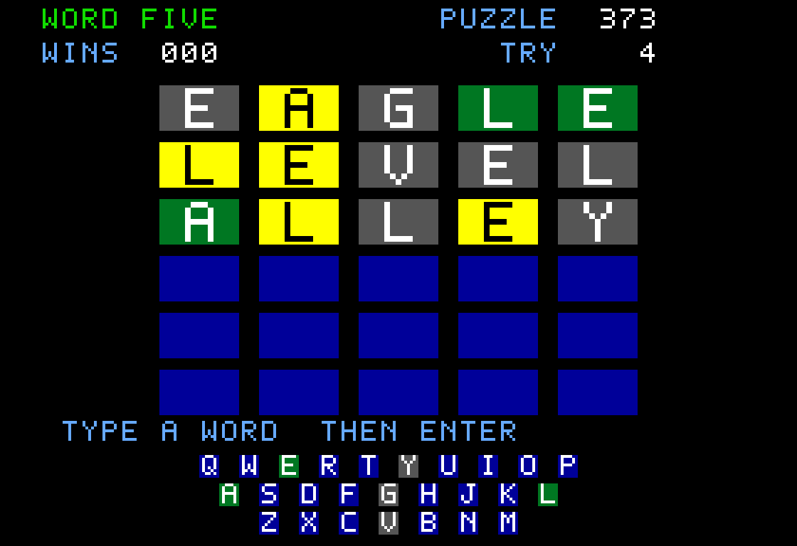

# Word Five ///

A Wordle-style puzzle game for the native Apple III. Run `make run GAME=wordle`.



Guess the five-letter answer in six tries. Green means a correct letter in the
correct position; yellow means a correct letter in another position; gray means
no remaining copy of that letter occurs in the answer. Exact matches are counted
first, so a repeated letter never gets more credit than the answer contains.
The keyboard keeps the strongest feedback each letter has earned.

## Play

- On the title, type a puzzle number from **1 to 405** and press **Return**.
  Return alone starts the displayed puzzle. **Space** chooses a random puzzle.
  Numbers are repeatable and cover every answer once in this version.
- Type letters, then **Return** to submit. **Backspace** or **Left Arrow** deletes
  the previous letter. Invalid words and incomplete guesses do not cost a turn.
- After winning or losing, **Return** starts the next puzzle; **Space** picks a
  random one. **Escape** returns to the title at any time.
- **Tab** toggles sound. Letter keys always enter letters, including M, N and P.

MAME's Apple III keyboard encoder has no translation for its Delete matrix entry.
The launcher maps host Backspace to the native left-arrow input, which sends
ASCII backspace. On a physical Apple III, use Left Arrow to edit.

The title shows completed games, wins and the current win streak. Statistics are
held in RAM until reset, capped at 999. Abandoned rounds are not counted. This is
a local practice game with numbered puzzles; it does not require a calendar,
account or internet connection. Updating the answer pool changes puzzle IDs.

## Dictionary and credits

The game accepts **4,482 five-letter American English words**, including ordinary
inflections and plurals. The **405 answers** are a hand-picked subset. This is
its own vocabulary, not the official Wordle dictionary.

`words.txt` is derived from the [English Speller Database (ESDB, formerly SCOWL)](https://github.com/en-wl/wordlist)
at commit [`1e5b7d3a72f47a71da5d28686c1dd4b397178485`](https://github.com/en-wl/wordlist/tree/1e5b7d3a72f47a71da5d28686c1dd4b397178485).
The complete upstream notice is preserved in
[WORDLIST-LICENSE.txt](WORDLIST-LICENSE.txt). Include that notice when distributing
this game or its word data. The build copies it alongside the boot images.

To reproduce the extracted dictionary from that upstream checkout:

```sh
make
./scowl word-list 50 A 1 > words-50.txt
```

Keep entries matching exactly `[a-z]{5}`, convert them to uppercase, deduplicate
and sort. `answers.txt` is the curated answer pool and every entry must belong to
the accepted dictionary. Normal game builds use the vendored text files and
need no downloads or ESDB installation.

`tools/wordlist.py` groups words by initial, encodes their remaining letters as
base-26 numbers, and stores variable-length differences. The full lexicon uses
6,872 bytes; answer references use two bytes each. A lookup only scans the chosen
initial's bucket. Python tests verify every word and answer survives this packing.

## Build and test

```sh
make
make test GAME=wordle
```

The MAME tests use keyboard input for every scenario, including repeated-letter
cases such as EAGLE against APPLE, both end states, sound and number selection.
The screenshot above also comes from keyboard-only play. Tests boot `.po` with
256 KB and `.dsk` with 128 KB. Hardware/FPGA testing remains separate.

Mount `build/wordle/wordle.po` or `build/wordle/wordle.dsk` in the internal floppy
drive. See the [root guide](../../README.md) for Apple III ROM setup.
